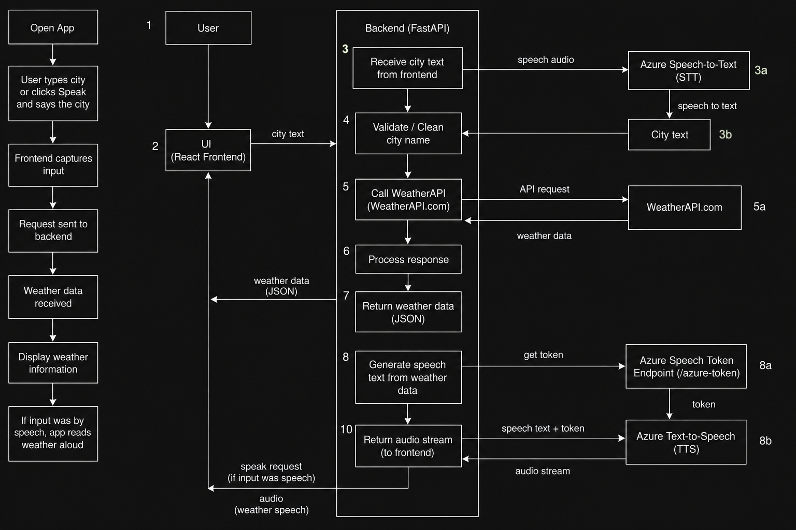

# Weather Voice App 🌦️🎙️

An AI-powered full-stack weather voice application that lets users type or speak any place name and get live weather updates. The app supports Speech-to-Text and Text-to-Speech using Microsoft Azure Speech Services.

---

# Live Demo

Frontend: https://weather-voice-app.vercel.app/ 
Backend: https://weather-voice-app-g7ai.onrender.com

---

# ✨ Features

- 🌤️ Real-time weather information
- 🎤 Voice-based location search
- 🔊 AI-generated weather narration
- 🌍 Global weather support
- 📱 Responsive modern UI
- ☁️ Azure Speech Services integration
- ⚡ FastAPI backend APIs
- ⚛️ React + Vite frontend
- 🚀 Deployment-ready architecture
- 🔄 CI/CD pipeline support
- 🧪 API testing support
- 🎨 Beautiful glassmorphism UI

___

# Tech Stack

| Category | Technology | Version |
|---|---|---|
| Frontend | React | 18+ |
| Frontend Build Tool | Vite | 5+ |
| Styling | CSS3 | Latest |
| Backend | FastAPI | Latest |
| Backend Language | Python | 3.11+ |
| Speech Services | Azure Cognitive Services | F0 Tier |
| Weather API | WeatherAPI.com | Free Tier |
| Deployment | Vercel | Latest |
| Backend Hosting | Render | Latest |
| CI/CD | GitHub Actions | Latest |
| Package Manager | npm | 10+ |
| Version Control | Git & GitHub | Latest |

---

# 🏗️ System Architecture

The diagram below shows the complete workflow of the Weather Voice App, including user input, frontend processing, backend API calls, WeatherAPI integration, and Azure Speech Services.


___

# 📁 Project Structure

```text
weather-voice-app/
├── backend/
│   ├── main.py
│   ├── requirements.txt
│   ├── .env
│   └── venv/
│
├── frontend/
│   ├── src/
│   │   ├── App.jsx
│   │   └── App.css
│   │
│   ├── public/
│   ├── package.json
│   ├── vite.config.js
│   └── capacitor.config.json
│
├── .github/
│   └── workflows/
│       └── ci.yml
│
├── README.md
├── run.sh
└── setup.sh
```
---

# ⚙️ Setup Instructions

Follow the steps below carefully to run the Weather Voice App locally on your system.

---

# 1️⃣ Clone the Repository

First, open Terminal and run:

```bash
git clone https://github.com/your-username/weather-voice-app.git
```

This downloads the complete project to your computer.

Now move into the project folder:

```bash
cd weather-voice-app
```

---

# 📂 Project Structure

The project contains:

```text
backend/   → FastAPI backend
frontend/  → React frontend
```

Both frontend and backend must run separately.

---

# 🔹 Backend Setup (FastAPI)

## Step 1 — Move into Backend Folder

```bash
cd backend
```

---

## Step 2 — Create Virtual Environment

Create a Python virtual environment:

```bash
python3 -m venv venv
```

Activate it:

### macOS/Linux

```bash
source venv/bin/activate
```

### Windows

```bash
venv\Scripts\activate
```

After activation, your terminal should show:

```text
(venv)
```

---

## Step 3 — Install Backend Dependencies

Install all required Python packages:

```bash
pip install -r requirements.txt
```

This installs:

- FastAPI
- Uvicorn
- Requests
- python-dotenv
- CORS middleware dependencies
- and other required backend libraries

---

# 🔑 API Key Setup

The application requires:

1️⃣ WeatherAPI key  
2️⃣ Azure Speech Service key

---

# 🌤️ WeatherAPI Setup

WeatherAPI is used to fetch real-time weather information.

It provides:

- temperature
- humidity
- wind speed
- weather conditions
- feels-like temperature

## Steps to get API key

Go to:

```text
https://www.weatherapi.com/
```

Create a free account.

After logging in:

- Open dashboard
- Generate API key
- Copy the API key

Example:

```text
abc123xyz456
```

---

# 🎤 Azure Speech Service Setup

Azure Speech Services are used for:

- Speech-to-Text (STT)
- Text-to-Speech (TTS)

This allows users to:

- speak city names
- hear weather results spoken aloud

---

## Steps to Create Azure Speech Service

Open Azure Portal:

```text
https://portal.azure.com
```

Create:

```text
Speech Service Resource
```

Select:

```text
Pricing Tier → F0 (Free)
```

The free tier is enough for development and demo usage.

After creation:

Open:

```text
Keys and Endpoint
```

Copy:

- Speech Key
- Region

Example region:

```text
centralindia
```

---

# 🔐 Create .env File

Inside the backend folder, create a file named:

```text
.env
```

Add:

```env
WEATHER_API_KEY=your_weather_api_key
AZURE_SPEECH_KEY=your_azure_speech_key
AZURE_SPEECH_REGION=your_azure_region
```

Example:

```env
WEATHER_API_KEY=abc123xyz456
AZURE_SPEECH_KEY=xxxxxxxxxxxxxxxx
AZURE_SPEECH_REGION=centralindia
```

---

# 🚀 Run Backend Server

Start the FastAPI backend:

```bash
uvicorn main:app --reload
```

If successful, you should see:

```text
Uvicorn running on http://127.0.0.1:8000
```

Backend now runs at:

```text
http://127.0.0.1:8000
```

---

# 🔹 Frontend Setup (React + Vite)

Open a NEW terminal window while keeping backend running.

---

## Step 1 — Move into Frontend Folder

From project root:

```bash
cd frontend
```

---

## Step 2 — Install Frontend Dependencies

Install all required npm packages:

```bash
npm install
```

This installs:

- React
- Vite
- Azure Speech SDK
- frontend dependencies
- required UI libraries

---

## Step 3 — Start Frontend

Run:

```bash
npm run dev
```

After a few seconds, terminal shows:

```text
http://localhost:5173
```

Open this URL in browser.

---

# 🎤 Azure Speech SDK

This project uses:

```text
microsoft-cognitiveservices-speech-sdk
```

for:

- Azure Speech-to-Text
- Azure Text-to-Speech

Install manually if required:

```bash
npm install microsoft-cognitiveservices-speech-sdk
```

---

# 🚀 Running the Full Application

You MUST keep BOTH running:

| Terminal | Purpose |
|---|---|
| Terminal 1 | FastAPI Backend |
| Terminal 2 | React Frontend |

---

# ✅ How to Use the Weather Voice App

1️⃣ Open frontend in browser

2️⃣ Type city name  
OR

3️⃣ Click:

```text
🎤 Speak
```

4️⃣ Speak a location

Example:

```text
Bangalore
```

5️⃣ Click:

```text
Get Weather
```

6️⃣ Weather details appear instantly.

If speech input was used:

- Azure Speech automatically reads weather aloud.

---


# 📡 API Checking

---

# GET /

Health check route.

## Example Request

```http
GET /
```

## Example Response

```json
{
  "message": "Weather Voice App backend is running"
}
```

---

# POST /weather

Returns weather information.

## Request

```json
{
  "city": "Bangalore"
}
```

## Response

```json
{
  "city": "Bangalore",
  "country": "India",
  "temperature": 29,
  "feels_like": 32,
  "humidity": 68,
  "wind_speed": 15,
  "condition": "Partly cloudy"
}
```

---

# GET /azure-token

Returns temporary Azure Speech token.

## Example Response

```json
{
  "token": "azure_token_here",
  "region": "centralindia"
}
```

---

# 🎤 Voice Recognition & AI Workflow

## Speech-to-Text Flow

```text
User Speech
     ↓
Azure Speech SDK
     ↓
Text Conversion
     ↓
Weather API Request
```

---

## Text-to-Speech Flow

```text
Weather Response
       ↓
Azure Speech Synthesis
       ↓
Voice Output
```

---

# 🧪 API Testing with Postman

## Test Weather Endpoint

### Method

```text
POST
```

### URL

```text
https://weather-voice-app-g7ai.onrender.com/weather
```

### Body

```json
{
  "city": "Delhi"
}
```

---

# 🚀 Deployment

## Frontend

Deployed using **[Vercel](VERCEL_DEPLOYMENT.md)**

## Backend

Deployed using **[Render](RENDER_DEPLOYMENT.md)**


# CI/CD

GitHub Actions workflow checks:

- Backend dependency installation
- FastAPI import validation
- Frontend dependency installation
- Vite production build

---

# 💰 Cost Breakdown

This project is designed to run almost completely on free-tier services for development, testing, and student/demo usage.

---

## 📦 Services Used

| Service | Purpose | Free Tier | Estimated Cost |
|---|---|---|---|
| React + Vite | Frontend | Fully Free | $0 |
| FastAPI | Backend Framework | Fully Free | $0 |
| WeatherAPI.com | Real-time weather data | Free developer tier | $0 |
| Microsoft Azure Speech Services | Speech-to-Text + Text-to-Speech | F0 Free Tier | $0 |
| GitHub | Version Control + CI/CD | Free | $0 |
| GitHub Actions | CI/CD Pipeline | 2000 free minutes/month | $0 |
| Render | Backend Deployment | Free Tier | $0 |
| Vercel | Frontend Deployment | Free Tier | $0 |

---

## ☁️ Azure Speech Services Free Tier

The application uses Microsoft Azure AI Speech Services for:

- 🎙️ Speech-to-Text (STT)
- 🔊 Text-to-Speech (TTS)

### Free Tier Includes

| Feature | Free Usage |
|---|---|
| Speech-to-Text | 5 audio hours/month |
| Neural Text-to-Speech | 500,000 characters/month |


---

## 🌦️ WeatherAPI.com Free Tier

The application fetches live weather data using WeatherAPI.com.

### Free Tier Includes

| Feature | Limit |
|---|---|
| API Requests | ~1 million/month |
| Real-time Weather | Included |
| Global Locations | Included |

This is more than enough for development and demo usage.


---

## 📊 Expected Monthly Cost

| Usage Type | Estimated Cost |
|---|---|
| Student / Demo Usage | $0 |
| Small Portfolio Project | $0 |
| Moderate Traffic | Usually still free |

---

## 📝 Notes

- The project is fully usable under free-tier limits.
- Costs may only arise if deployed at very large production scale.
# Security

- API keys are stored only in backend environment variables
- Frontend never directly exposes WeatherAPI or Azure keys
- Azure Speech token is generated securely through backend routes

---

# Future Improvements

- Weather icons
- Animated backgrounds
- Multilingual speech support
- Voice selection
- Search history
- Favorite cities
- PWA install support
- Android APK generation
- iOS app build
- Better animations and transitions

---

# Author

Nanditha Nair  
GitHub: NandithaNair19
